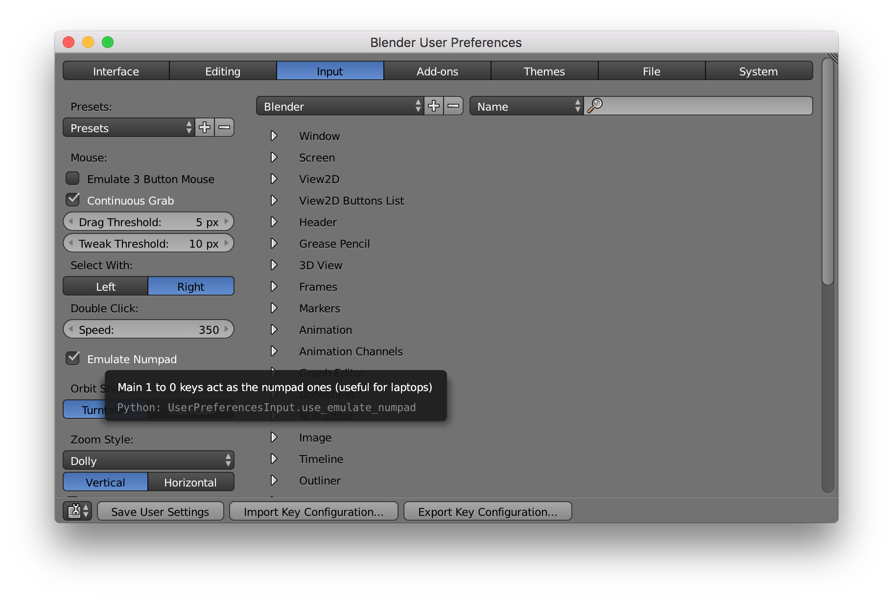
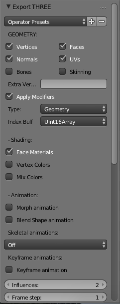

# Blender Guide for Beginners

I don't use blender every day, so every time I come back I've forgotten some of the most basic commands and need to google them again and watch some lengthy videos to find out simple answers.

To save time in the future I'll collect those answers here, in a very condensed format, accompanied by screenshots when needed.

# Table of contents
<!-- TOC depthFrom:1 depthTo:6 withLinks:1 updateOnSave:1 orderedList:0 -->

- [Blender Guide for Beginners](#blender-guide-for-beginners)
- [Table of contents](#table-of-contents)
	- [Settings](#settings)
		- [Emulate numpad](#emulate-numpad)
		- [Change to metric units](#change-to-metric-units)
	- [View](#view)
		- [Wireframe mode](#wireframe-mode)
		- [Reset 3D cursor position](#reset-3d-cursor-position)
		- [Center the view](#center-the-view)
		- [Camera fly mode](#camera-fly-mode)
		- [Preview render](#preview-render)
	- [Objects](#objects)
		- [Measure 3D object size](#measure-3d-object-size)
		- [Toggle between Edit and Object mode](#toggle-between-edit-and-object-mode)
		- [Select all and deselect all](#select-all-and-deselect-all)
		- [Select faces around](#select-faces-around)
		- [Bridge faces together](#bridge-faces-together)

<!-- /TOC -->

## Settings

### Emulate numpad
A lot of shortcuts need numpad, and I don't have numpad on any of my keyboards. Remember to click save user settings after you turn it on.

### Change to metric units
In the right hand panel, under the scene tab.

## View

### Wireframe mode
`Z`

### Reset 3D cursor position
`Shift-C`

### Center the view 
* Around the 3D cursor `Fn+Alt+Left` (or Alt+Home if you have home button)
* Mouse cursor `Alt+F`

### Camera fly mode
`Shift-F` and then use WASD+mouse to fly.

### Preview render
`Shift-Z` to toggle preview render on/off

## Objects
### Measure 3D object size
`N` while in object mode, you will see dimensions in the transform panel.

### Toggle between Edit and Object mode
`Tab`

### Select all and deselect all
`A`

### Select faces around
`Ctrl+Shift+Alt+F` and then adjust the "sharpness" angle.

### Bridge faces together
Select faces to bridge + `W` + "Bridge edge loops".

In the screenshot below the object was broken (there were double vertices hiding inside the shape and they were not connected, resulting in a ugly render). I selected four of those 8 vertices, pulled them away from the other 4, then selected the opposing faces, and bridged them together.

## Three.js Exports
### Multiple materials for one object
When exporting, remember to check "Face Materials" checkbox in Blender under the "Shading" part of the export options.

In Three.js initialize each material as you would normally, then create a "MeshFaceMaterial" from those like this:

`var faceMaterial = new THREE.MeshFaceMaterial([firstMaterial, secondMaterial]);`

And assign that to the mesh:

`var thingie = new THREE.Mesh(geometry, faceMaterial);`

